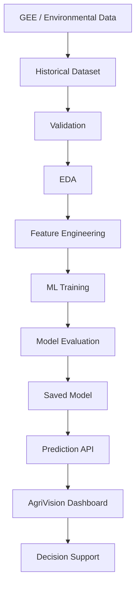

# AgriVision AI: A Climate-Aware Crop Health Monitoring and Decision Support System Using Google Earth Engine and Machine Learning

## 1. Project Overview
AgriVision AI is an end-to-end system that uses satellite imagery, climate/environmental data, and machine learning to monitor crop vegetation conditions, identify possible crop stress, predict near-future crop health conditions, and provide understandable decision-support information through a web application. The system demonstrates how freely available Earth observation and climate datasets can be combined with machine learning to provide an early indication of changing crop conditions.

## 2. Problem Statement
Farmers may detect crop stress only after visible symptoms appear. Vegetation stress can be influenced by environmental conditions such as insufficient rainfall, excessive rainfall, and temperature variations. Satellite and environmental datasets can provide repeated observations of vegetation and environmental conditions over time to help identify patterns and predict near-future vegetation conditions.

## 3. Project Objectives
- Monitor current vegetation condition of the selected agricultural area.
- Analyze how vegetation condition has changed over time.
- Identify environmental conditions associated with changes in vegetation.
- Predict near-future vegetation condition.
- Identify potential environmental stress.
- Provide understandable decision-support information to users.

## 4. Study Area
**Location**: Kavathe + Khanapur, Wai Taluka, Satara District, Maharashtra, India.
**Coordinates**:
- Khanapur: Latitude: 17.9385, Longitude: 73.9396
- Kavathe: Latitude: 17.9444, Longitude: 73.9767
*Note: The study area remains configurable to support other locations in the future.*

## 5. Data Sources
The primary datasets are sourced from Google Earth Engine:
1. **Sentinel-2 Surface Reflectance** (`COPERNICUS/S2_SR_HARMONIZED`): Derives NDVI.
2. **Sentinel-2 Cloud Probability** (`COPERNICUS/S2_CLOUD_PROBABILITY`): Cloud-quality filtering.
3. **CHIRPS Daily Rainfall** (`UCSB-CHG/CHIRPS/DAILY`): Rainfall measurements (mm).
4. **ERA5-Land Daily Aggregated** (`ECMWF/ERA5_LAND/DAILY_AGGR`): Near-surface air temperature (°C).
5. **MODIS Land Surface Temperature** (`MODIS/061/MOD11A2`): Land surface temperature (°C).

## 6. Dataset Structure
**Master Dataset**: `dataset/AgriVision_Weekly_Dataset_2021_2025_IMPROVED.xlsx`
**Features**:
- `Week_Start`, `Week_End`, `Week_Number`, `Year`
- `NDVI`, `Rainfall_mm`, `Temperature_C`, `LST_C`
- `Sentinel2_Images`, `CHIRPS_Images`, `ERA5_Images`, `MODIS_LST_Images`
- `study_area`

## 7. Data Pipeline
[IN PROGRESS]
Google Earth Engine handles data acquisition and export. The historical dataset is pre-processed and ready for EDA. Further pipelines will handle live acquisition and preprocessing.

## 7.1. GEE DATA GENERATION PIPELINE
The master historical dataset is generated using the Google Earth Engine JavaScript pipeline (`gee/agri_vision_dataset.js`).

1. **Study Area**: Kavathe and Khanapur (points) buffered by 4000m and unioned.
2. **Historical Period**: 2021-01-01 to 2026-01-01.
3. **Source Collections**: Sentinel-2 (SR_HARMONIZED), CHIRPS Daily Rainfall, ERA5-Land Daily Aggregated, MODIS 8-day LST (MOD11A2).
4. **Sentinel-2 Cloud Handling**: Filtered at scene level (<= 90% cloud cover) and pixel level (<= 70% cloud probability using S2_CLOUD_PROBABILITY collection).
5. **NDVI Generation**: Median of clear Sentinel-2 pixels using `(B8 - B4) / (B8 + B4)`.
6. **Rainfall Processing**: Sum of CHIRPS precipitation over the exact 7-day week.
7. **Temperature Processing**: Mean of ERA5-Land over the 7-day week, converted to Celsius (subtract 273.15).
8. **LST Processing**: Mean of MODIS over the window, scaled (multiply by 0.02) and converted to Celsius.
9. **Weekly Temporal Aggregation**: Time is split into strict 7-day intervals starting from 2021-01-01. Sentinel-2 and MODIS use wider temporal windows (Week Start - 7 days to Week End + 7 days) to find available imagery; Rainfall and Temperature use exact weekly intervals.
10. **AOI Reduction**: `ee.Reducer.mean()` over the unioned study area at 1000m scale (tileScale 4).
11. **Missing/Incomplete Data Handling**: Masked fallback images are used to prevent Earth Engine collection errors during empty weeks. No interpolation is performed.
12. **Quality Filtering**: Final dataset filters out any week missing NDVI, Rainfall, Temperature, or LST. 
13. **Export Schema**: `Week_Start`, `Week_End`, `Week_Number`, `Year`, `NDVI`, `Rainfall_mm`, `Temperature_C`, `LST_C`, `Sentinel2_Images`, `CHIRPS_Images`, `ERA5_Images`, `MODIS_LST_Images`, `study_area`.
14. **Relationship between GEE output and the master dataset**: The GEE script exports the exact CSV column schema specified. Any gaps in data (weeks without observations) are intentionally left out of the final valid dataset export.

## 7.2. TEMPORAL FEATURE ENGINEERING AND TARGET DEFINITION
The temporal feature engineering pipeline strictly prevents target leakage and cleanly handles temporal gaps.
1. **Prediction Objective**: Predict the NDVI of the following valid weekly observation, given information available up to the current week. This is a purely forward-looking model.
2. **Target Definition**: `NDVI_next_week`. Generated by shifting NDVI backward by 1, but explicitly masked as missing (`NaN`) if the subsequent row is not exactly 7 days later.
3. **Lag Features**: Created for `NDVI`, `Rainfall_mm`, `Temperature_C`, and `LST_C` for lags 1, 2, 3, and 4. A lag value is only populated if the time delta between the current observation and the lagged observation is exactly `7 * lag` days.
4. **Rolling Features**: Backward-looking rolling averages/sums (window=4) for current-week environmental and vegetation variables. These are masked as missing if the window spans a temporal gap (i.e., if the 3rd prior observation is not exactly 21 days prior).
5. **Seasonal Features**: Created `month`, `week_of_year`, `sin_week`, and `cos_week` using ISO week configurations to model cyclic timing without future information.
6. **Gap Handling**: Missing weeks are NOT interpolated. Any feature or target that requires spanning across a temporal gap is set to missing (`NaN`). This enforces scientific validity over sheer dataset size.
7. **Leakage Prevention**: No composite "Health Score" is calculated. Current-week NDVI remains a predictor, but the target `NDVI_next_week` is strictly separated.
8. **Chronological Split Strategy**: The dataset will be split purely chronologically (e.g., Train: <= 2023-12-31, Validation: 2024, Test: >= 2025). No random splitting is used.

## 8. MACHINE LEARNING MODEL DEVELOPMENT
[IMPLEMENTED]
The ML pipeline predicts near-future vegetation conditions based on current and past environmental drivers.
1. **Prediction Objective**: Predict `NDVI_next_week`.
2. **Target Variable**: `NDVI_next_week` (Continuous Regression).
3. **Candidate Features**: `NDVI`, `Rainfall_mm`, `Temperature_C`, `LST_C`, Sentinel-2/MODIS/CHIRPS/ERA5 image counts, and all corresponding lag (1, 2, 3, 4), rolling (4-week sum/mean/std), and seasonal (month, week_of_year, sin_week, cos_week) features.
4. **Leakage Prevention**: All future information (`Week_Start`, `Week_End`) is strictly dropped. The target `NDVI_next_week` is carefully aligned to ensure it never bleeds into the current week's inputs.
5. **Missing-Value Handling**: Complete-case analysis is used. Any row containing a `NaN` due to temporal gaps (either in target or a required lag feature) is dropped from the modeling dataset.
6. **Chronological Train/Validation/Test Split**: 
   - Train: `Week_Start <= 2023-12-31`
   - Validation: `Week_Start > 2023-12-31 and <= 2024-12-31`
   - Test: `Week_Start > 2024-12-31`
7. **Baseline Models**: 
   - Persistence Baseline: Simply predicting that next week's NDVI will equal this week's NDVI.
   - Linear Regression.
8. **Random Forest**: `RandomForestRegressor` with conservative hyperparameters (`n_estimators=100, max_depth=10, min_samples_leaf=2`) to prevent overfitting on the small dataset.
9. **Optional XGBoost**: `XGBRegressor` (`n_estimators=100, max_depth=6, learning_rate=0.1`) if the environment supports it.
10. **Evaluation Metrics**: Mean Absolute Error (MAE), Root Mean Squared Error (RMSE), and R-squared (R²).
11. **Model Selection Criteria**: The primary selection criterion is lowest Test MAE, followed by stability between Train/Val/Test.
12. **Feature Importance**: Gini importance (Random Forest) is extracted to understand which environmental drivers most strongly impact NDVI changes.
13. **Limitations**: The model is trained on a single study area with a relatively small sample size (~123 training rows) and temporal gaps. R² is artificially high due to the high autocorrelation of weekly NDVI.

## 9. MODEL SERVING AND INFERENCE CONTRACT
[IMPLEMENTED]
The system employs a dual-model approach for serving predictions:
1. **Persistence Baseline**: Serves as the robust primary benchmark, returning the current week's NDVI.
2. **Operational ML Model**: A tuned Random Forest Regressor (`random_forest_model.joblib`), selected for its strong generalization (Test R²=0.94) without the severe overfitting seen in Gradient Boosting.
3. **Saved Artifacts**: The model is serialized via `joblib`, and its exact 36-feature schema is frozen in `model_features.json` to guarantee precise input ordering during inference.
4. **Inference Requirements**: The model requires 36 specific features across CURRENT, LAG, ROLLING, and SEASONAL categories (documented in `inference_schema.json`).
5. **Live Inference Feasibility**: The model CANNOT generate a live prediction using only the current date and coordinates. A future backend feature-generation layer must reconstruct the previous 4 weeks of observations (NDVI, Rainfall, Temp, LST) to satisfy the lag and rolling requirements.
6. **No Retraining**: The API must only load the frozen artifacts and execute `predict.py`. No retraining will occur dynamically.


## 13. Backend Architecture
[PLANNED]
REST API (e.g., FastAPI/Flask) to serve predictions and historical data to the frontend.

## 14. Frontend Architecture
[PLANNED]
Decision-support dashboard to visualize location, latest vegetation information, environmental trends, and understandable recommendations.

## 15. API Strategy
[PLANNED]
The backend will expose endpoints for observed data, ML predictions, and decision-support interpretation separately.

## 16. Model Serving Strategy
[PLANNED]
Serialized models will be loaded into the backend API. The API will perform the same feature engineering steps as during training.

## 17. Folder/Repository Structure
[IN PROGRESS]
```
AgriVision/
├── architecture.md
├── PROJECT_STATUS.md
├── README.md
├── dataset/                  # Master datasets
├── ml/                       # Machine learning pipeline
│   ├── eda.py                # Exploratory Data Analysis
│   └── eda_outputs/          # EDA generated reports and plots
└── backend/                  # Backend API (Planned)
└── frontend/                 # Frontend App (Planned)
```

## 18. Data Flow


## 19. Separation between Training and Inference
[PLANNED]
Training logic will remain isolated from the production API. The API will only perform inference and will load frozen model artifacts.

## 20. Configuration Strategy
[PLANNED]
Environment variables and configuration files (e.g., `.env`) for paths, variables, and API keys.

## 21. Environment Variable Strategy
[PLANNED]
Secrets and environment-specific settings managed via `.env` (excluded from version control).

## 22. Testing Strategy
[PLANNED]
Unit tests for data preprocessing, API endpoints, and ML validation scripts.

## 23. Reproducibility Strategy
[IMPLEMENTED - INITIAL STAGE]
Use `requirements.txt` / dependency files. Clear entry points for running modules (e.g., `python ml/eda.py`). Random seeds in ML models.

## 24. Research/Academic Considerations
[IN PROGRESS]
Focus on methodological validity, proper data splits, no leakage, and transparent metrics over absolute accuracy claims. Avoid definitive diagnosis claims.

## 25. Data Quality Rules
[IMPLEMENTED]
The EDA and ML pipeline are strictly read-only on the master dataset. Gaps in data are kept and not artificially filled.

## 26. ML Leakage Prevention Rules
[IMPLEMENTED]
No Target Leakage. No target creation based on a combination of current features. Data splitting is strictly chronological.

## 27. Future Extensibility
[PLANNED]
The pipeline is designed to easily plug in new study areas by changing the configuration, assuming data is formatted correctly.

## 28. Current Implementation Status
- Initial Repository Setup: IMPLEMENTED
- Architecture Documentation: IMPLEMENTED
- Exploratory Data Analysis (EDA): IN PROGRESS
- ML Pipeline: PLANNED
- Backend/Frontend: PLANNED

## 29. Planned Implementation Phases
1. EDA and Validation
2. Feature Engineering
3. ML Model Training & Evaluation
4. API Integration
5. Dashboard Development

## 30. Known Limitations and Assumptions
- Dataset contains 20 gaps due to cloud cover/incomplete data. These are intentionally not interpolated.
- Predictions indicate vegetation stress/health trends but do not directly diagnose disease.
